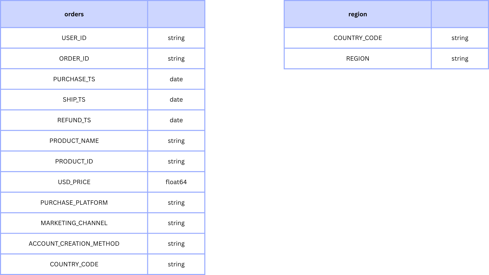

# **Project Background**

NovaTech is a global e-commerce retailer specializing in high-performance gaming hardware and accessories ranging from next-gen consoles like the Sony PlayStation 5 and Nintendo Switch to premium gaming monitors, laptops, headsets, and mice. Operating across four regions (North America, EMEA, APAC, and LATAM), NovaTech sells primarily through its web and mobile applications, supported by a multi-channel acquisition strategy involving direct traffic, affiliate partnerships, email marketing, and social media campaigns.

To support strategic business decisions, historical sales data from 2019 to 2021 was analyzed across several key areas:

- **Sales Trends Analysis:** Evaluation of historical sales patterns globally and by region, focusing on Sales, Average Order Value (AOV) and Total Orders
- **Product Level Performance:** Evaluated product-level performance to identify top sellers and underperformers
- **Regional Level Performance:** Analyzed regional performance to identify core market reliance and untapped international expansion opportunities.

The Microsoft Excel spreadsheets used to inspect and clean the data for this analysis can be found here [link](data/orders_data_cleaned.xlsx)

An interactive Tableau dashboard used to report and explore sales trends can be found here [link](https://public.tableau.com/views/SalesDashboard_17831844574330/Dashboard1?:language=en-US&:sid=&:redirect=auth&:display_count=n&:origin=viz_share_link)

# **Data Structure & Initial Checks**

NovaTech’s transactional database consists of two core relational tables containing 21,863 order records:

- **`orders`**: Stores order-level transactional data including `user_id`, `order id`, `purchase_ts`, `ship_ts`, `product_id`, `product_name`, `usd_price`, `purchase_platform`, `marketing_channel`, `account_creation_method`, and `country_code`
- **`region`**: Geographic mapping table used to cross reference `country_code` entries against 4 regions (North America, EMEA, APAC, LATAM).

Prior to beginning analysis, a variety of checks were conducted for quality control and familiarization with the datasets. The Microsoft Excel spreadsheets used to inspect and clean the data for this analysis can be found here [link](data/orders_data_cleaned.xlsx)

# **Executive Summary**

## **Overview of Findings**

Between January 2019 and February 2021, NovaTech generated **$6.15 million** in total sales across **21,863 orders** with an Average Order Value (AOV) of **$281.** It is heavily driven by a historic pandemic-induced surge in **2020,** reaching an all-time monthly peak of **$549K** in **December 2020** before entering a sharp drop to **$289K** in **January 2021.** This contraction was heavily driven by a synchronized sales drop across the company's top three revenue-generating products across all four operational regions.

<aside>

**💡 Key Takeaways**

- Sales peaked in **December 2020** at **$549K** due to pandemic surge but declined to **$289K** in **January 2021**.
- **27in 4K gaming monitor, Nintendo Switch and Sony PlayStation 5** are 3 flagship products generate **~80%** of annual sales, making overall business health highly vulnerable to hardware lifecycle shifts
- Regionally, **North America** consistently drives **~50%** of annual sales, while **APAC and LATAM** remained flat (**~20% combined**), signaling under-penetration in emerging markets.
- The Q1 2021 post-lockdown sales drop occurred simultaneously across all regions, confirming a global market adjustment rather than a localized operational issue.
</aside>

Below is the overview page from the Tableau dashboard. The interactive dashboard can be seen here. 

# **Insights Deep Dive**

**Sales Trends Analysis:**

- **Over 100% YoY increase in monthly sales across 2020** as global COVID-19 lockdowns abruptly forced toward home entertainment spending.
- In **December 2020**, NovaTech achieved its highest single-month sales performance on record with **$549,000 monthly sales** across **1,671 orders** with an Average Order Value (AOV) of **$329**, capping off earlier demand surges in April 2020 and September 2020.
- **188% volume expansion compared to 2019 baselines** in **post-lockdown sales retention.** Despite declining sharply from the December 2020 peak, January 2021 sales remained nearly triple pre-pandemic monthly averages, proving a permanently higher baseline customer footprint.
- Across both 2019 and 2020, performance consistently accelerated sharply during **September** (Back-to-School/Fall launches) and **December** (Holiday peak).

**Product Level Performance:**

- **27in 4K gaming monitor, Nintendo Switch and Sony PlayStation 5** are the 3 products that consistently contributes to **~80% of total sales** annually, indicating high reliance on a small product set.
- **~80% share of early 2021 revenue contraction** in **product-level loss share.** The sharp decline observed in early 2021 was explicitly driven by sales contraction in the top three hardware lines as post-lockdown buying cooled.
- Lower-margin accessory tiers (gaming mice, headsets) contributed to **less than 2%** of sales but maintained stable, flat sales lines throughout both pandemic spikes and post-lockdown dips.

**Regional Growth:**

- **North America** contributed about **50% of total sales each year,** indicating strong brand presence but also potential over reliance in one region.
- **EMEA** maintained its standing as NovaTech’s second-largest operational theater with **~30% annual sales contribution** in **regional market share**, providing a consistent supporting revenue pillar.
- **20% combined annual sales share across APAC & LATAM** in **emerging market revenue share.** Despite global pandemic tailwinds in 2020, APAC and LATAM showed flat growth trajectories, pointing to untapped expansion potential or localized go-to-market friction.
- In **early 2021,** sales deceleration occurred across North America, EMEA, APAC, and LATAM simultaneously, confirming the correction was macroeconomic rather than warehouse-specific.

# **Recommendations:**

Based on the insights and findings above, the following recommendations are provided:

- Since ~80% of sales depend on just 3 products, the Product Team should **introduce exclusive product bundles** that pair high-ticket items (PS5, 27in 4K monitors) with high-margin, stable accessories (gaming mice, headsets) to stabilize revenue streams during off-peak periods.
- Since accessories items contributed less than 2% sales share, Product Team can create a **budget-friendly "gaming starter kits"** to capture price-sensitive consumers stepping away from premium console or monitor purchases.
- Sales consistently spike in September and December. Marketing team can **align promotional ad spend, inventory build-ups, and email marketing triggers** to ramp up **3–4 weeks prior** to September and December peak windows.
- Given that APAC and LATAM contributed only ~20% combined revenue throughout the pandemic boom. Growth Team to conduct localized pricing audits in APAC and LATAM to capture untapped market share.

# **Assumptions and Caveats:**

Throughout the analysis, multiple assumptions were made to manage challenges with the data. These assumptions and caveats are noted below:

- Data for 2021 concludes in early February. Consequently, 2021 metrics represent Q1 performance baselines rather than full-year performance.
- Variations in database product strings (e.g., "27in 4K gaming monitor" vs. "27inches 4k gaming monitor") were cleansed and standardized into unified product buckets during initial data preparation.
- A small fraction of transactional records contained unmapped country entries labeled as "unknown" in the database. These records were retained for overall sales metrics ($6.15M total) but excluded from regional percentage share calculations.
- 45 records (<1% of total dataset) containing missing purchase dates or $0 transaction values were logged during data inspection and retained, as their inclusion did not skew high-level trends or AOV calculations.
